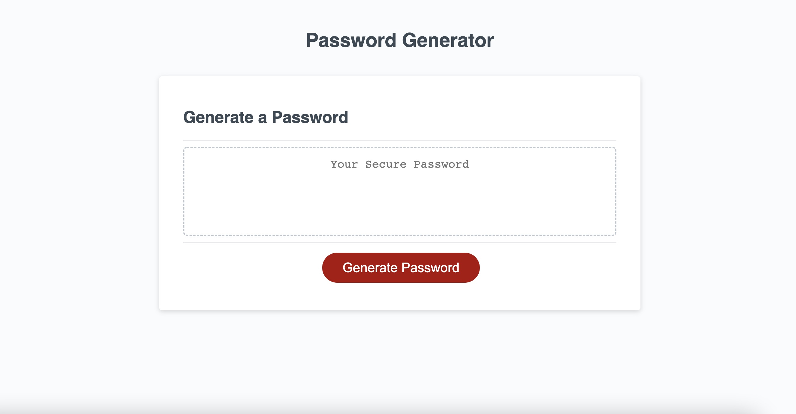

# Random Password Generator: password-generator

DU Boot Camp Module 3 Challenge: JavaScript Password Generator

---

## Description

The purpose of this challenge was to improve my coding skills specifically with JavaScript, but also some HTML and CSS. The goal was to add to existing code to get the random password generator to function properly and provide a good user experience.

This random password generator has the main purpose to create more secure passwords for users. There is multiple criteria options to cater to the user's preference including length and character options.

### Requirements

List of requirements derrived from the acceptance criteria and my personal expectations:

- User presented with multiple prompts to personalize a random password based on certain criteria.
  - Prompts include: length, uppercase characters, lowercase characters, numbers, and special characters.
- Generator requiring user to select at least one character type.
- Generated password displayed on webpage with user's selected criteria.

### Skills Learned/ Improved

Some skills that I have learned and/or improved from completing this assignment:

- Proper use of HTML, CSS, and JavaScript syntax.
- Gained better understanding of funtions, if/else if statements, and for statements in JavaScript.
- Using prompts and confirms to create an interactive user experience.
- Creating and assigning variables.
- Using the console on Chrom Dev Tools to confirm if code is read/ running correctly.
- Debugging code in Dev Tools.

Tools used to complete this project:

- HTML, CSS, JavaScript
- Chrome Dev tools
- VS Code

## Usage

This application is used to generate a random password based on the criteria that the user selects. The random password generator's main purpose is to help create more secure passwords.

### Links

<!-- Add links -->

[Link]() to deployed website.

[Link]() to code repository.

## Credits

I recieved guidance and tips from the instructional staff, TA's, and Students from the University of Denver Coding Boot Camp.

Ehren Lewis (DU Boot Camp student) particularly helped me with getting the password to generate on the webpage.
